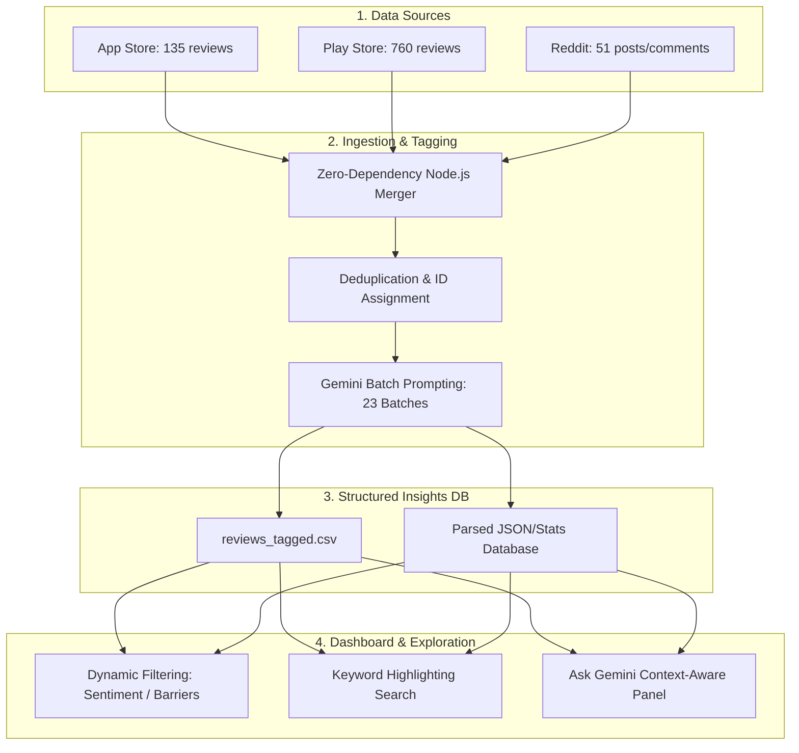

# Slide 3: We analyzed 1,000+ reviews with an AI pipeline — here’s how

**Headline:** Building a zero-dependency AI Review Engine to ingest, tag, and analyze qualitative feedback at scale.

---

## Visual Workflow Diagram (Mermaid)

---

## Slide Content Bullets

* **Raw Data Curation**: Aggregated **946 unique user reviews** (135 Apple App Store, 760 Google Play Store, and 51 Reddit posts/comments) filtering for core discovery terms like *recommendation, shuffle, repeat, same songs, playlist*.
* **LLM Ingestion Pipeline**: Parsed and batched the raw corpus through Gemini to extract multi-dimensional tags:
  * **Sentiment Analysis** (Positive, Neutral, Negative)
  * **Core Themes** (e.g. *smart_shuffle_loops, cross_mix_contamination, over_personalization*)
  * **Discovery Barriers** (*trust, effort, mood, context, social, algorithm sameness*)
  * **Verbatim Quotes & Desired Behaviors**
* **The Explorer Dashboard**: Designed a lightweight local dashboard at `http://localhost:3000/` merging the raw texts with structured tags. This features real-time search with regex text-highlighting and an **"Ask Gemini" query interface** that feeds the filtered subset directly to Gemini to perform contextual synthesis in seconds.

---

## Actionable Link to Showcase
* **Review Analysis Dashboard (Localhost)**: [Local Dashboard (http://localhost:3000/)](http://localhost:3000/)
* **GitHub Repository Code**: [github.com/shubham112-bip/spotify-discovery](https://github.com/shubham112-bip/spotify-discovery)
