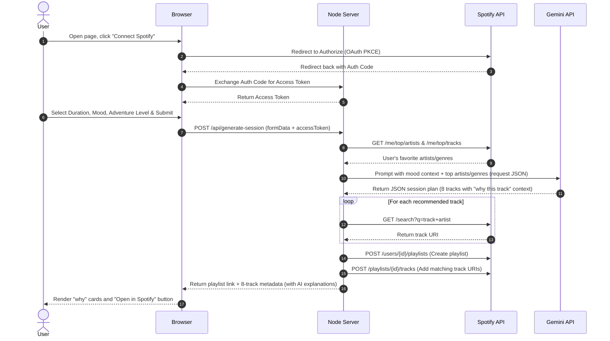

# Commute Compass — Detailed Architecture

This document describes the technical architecture of **Commute Compass**, an AI-native Spotify discovery agent built for commute listeners.

---

## 1. System Overview

Commute Compass is built as a single-page application frontend served by a lightweight Node.js Express server. It uses a zero-dependency backend architecture for stability on Windows.

### Component Diagram

```
+-------------------------------------------------------+
|                       BROWSER                         |
|                                                       |
|  +--------------------+       +--------------------+  |
|  |     Landing Page   |       |    Context Form    |  |
|  | (Connect Spotify)  |       | (Mood, Duration,   |  |
|  +---------+----------+       |  Adventure Level)  |  |
|            |                  +---------+----------+  |
|            v                            |             |
|   [Spotify OAuth PKCE]                  v             |
|   (Direct token flow)         [Client AJAX Request]   |
|            |                            |             |
|            +---------+ +----------------+             |
|                      | |                              |
+----------------------|-|------------------------------+
                       | |
                       | | HTTP POST (w/ Access Token & Form Data)
                       v v
+----------------------+--------------------------------+
|                   NODE.JS SERVER                      |
|                                                       |
|   +-----------------------------------------------+   |
|   |                 Express API                   |   |
|   |                                               |   |
|   |   1. Fetch taste profile from Spotify API     |   |
|   |   2. Fetch context recommendations from Gemini|   |
|   |   3. Match tracks via Spotify Search API      |   |
|   |   4. Generate Playlist via Spotify Playlist API|  |
|   +-----------------------+-----------------------+   |
+---------------------------|---------------------------+
                            |
           +----------------+----------------+
           |                                 |
           v                                 v
+----------+----------+           +----------+----------+
|  SPOTIFY WEB API    |           |    GEMINI PRO API   |
|                     |           |                     |
|  - Get User Profile |           |  - Generate session |
|  - Get Top Tracks   |           |    plan (JSON) based|
|  - Create Playlist  |           |    on taste context |
+---------------------+           +---------------------+
```

---

## 2. Key Technology Choices

| Layer | Technology | Rationale |
|---|---|---|
| **Frontend** | Vanilla HTML5, CSS3, JavaScript (ES6) | Avoids build issues on Windows; loads instantly; easy state management using simple DOM updates. |
| **Backend** | Node.js + Express | Lightweight, handles Spotify API proxying to bypass CORS, and coordinates LLM prompting. |
| **API Authentication** | Spotify OAuth (Authorization Code Flow with PKCE) | Secure login that keeps the access token in browser/session memory. |
| **LLM Engine** | Google Gemini API (`gemini-1.5-flash` / `gemini-1.5-pro`) | Powerful context comprehension, supports native JSON schema execution, and fits with the existing Gemini keys. |
| **Styling** | Vanilla CSS (Spotify-inspired dark theme) | Sleek modern aesthetics using HSL colors, responsive grid, glassmorphism, and hover animations. |

---

## 3. Data Flow



---

## 4. Security & Secrets

1. **Client Secrets**: `SPOTIFY_CLIENT_ID` and `SPOTIFY_CLIENT_SECRET` will be kept exclusively on the server using Node `.env` config variables.
2. **API Keys**: Google Gemini API key will be read from the server's `.env` configuration (not exposed to client) for security.
3. **Session Tokens**: Spotify access tokens are kept in browser memory or Express session storage, never committed to git.
