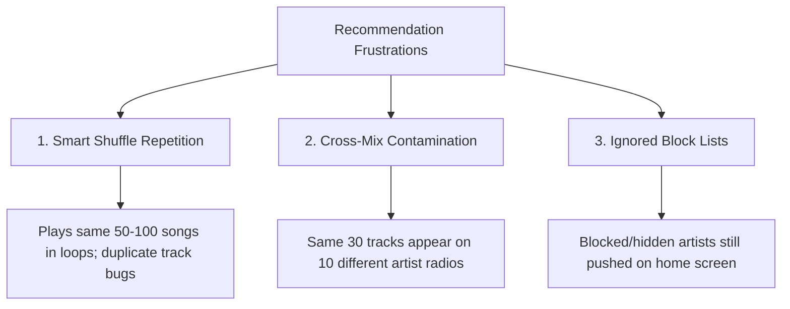

# AI Insights Memo: Spotify Discovery & Recommendation Barriers
**Project**: Spotify Music Discovery (Commute Compass)  
**Date**: June 18, 2026  
**Author**: Shubham (Graduation Project Fellow)  
**Dataset**: 946 analyzed Spotify user reviews (App Store, Play Store, Reddit)

---

## Executive Summary

This memo synthesizes the findings of our AI review analysis pipeline. By analyzing **946 unique feedback items**, we investigate why modern music streaming users are struggling to discover new music and why they are trapped in a loop of repeat listening. 

Our data shows a highly polarized user base. In reviews expressing specific feedback (excluding general app bugs and ad complaints), **UI/UX Friction (30.1%)**, **Algorithm Mismatch (2.6%)**, **Smart Shuffle Repetition (2.4%)**, and **Over-Personalization (0.5%)** emerge as the primary bottlenecks preventing users from successfully exploring new music.

---

## 1. Why do users struggle to discover new music?

Based on the synthesis of 946 reviews and deep qualitative Reddit analysis, users struggle to discover new music because **Spotify’s recommendation system prioritizes short-term engagement (playing what the user already likes) over long-term discovery (helping the user explore).**

* **The Echo Chamber Effect**: The algorithm leans so heavily on historic listening data that it locks users into a specific taste profile. If a user listens to a background genre (e.g., Lofi for studying or instrumentals for reading), the system "hard-locks" onto that genre and floods their discovery channels with it.
* **The "Made for You" Takeover**: Curated global playlists (like "Summer 2026") are dynamically modified for each individual listener. Because users only see their own taste reflected back at them, they have no way to explore organic trends or discover songs outside their bubble.
* **Broken Skip Signals**: The algorithm fails to process negative feedback. When a user actively skips a track or artist, the system frequently recommends them again in related radios or mixes, leading to frustration.

---

## 2. What are the most common recommendation frustrations?

When users seek new music, they run into three major mechanical frustrations:

1. **Smart Shuffle Repetition**: Rather than introducing high-quality variety, Smart Shuffle frequently inserts the exact same 30–50 tracks in a repeating loop. 
   > *Exemplar (reddit_008_c1):* "With the Smart Shuffle update, they messed something up... I'm getting sick of my loved songs since I can't listen to anything else."
2. **Cross-Mix Contamination**: Unique mixes (e.g. "Chappell Roan Radio") are contaminated by the user's general favorite artists (e.g. "Big Thief"), even when they belong to completely different genres.
   > *Exemplar (reddit_015):* "I went to listen to like 10 different mixes this morning and they all had the same 30 songs on it by artists that I like but that have nothing to do with the artist radio/mix... Like ytf is Big Thief coming on Chappell Roan Radio? I want pop music!"
3. **Ignored Block Lists**: Spotify's explicit "Don't play this artist" button is frequently bypassed by sponsored recommendations and home page features.
   > *Exemplar (reddit_007):* "I have quite a few artists I've selected 'don't play this artist' on... and yet Spotify keeps putting them on my recommendations for almost every playlist... through multiple uninstalls and reinstalls."

---

## 3. What listening behaviors are users trying to achieve?

From our data, users are not trying to browse music passively; they are looking to achieve specific, context-driven listening states:

* **Routine/Commute Listening (Daily 30–60 mins)**: High-frequency users who listen during commutes, chores, or driving need hands-off, high-quality music that fits their active vibe without requiring manual playlist management.
* **Mood/Context Alignment**: Users want music tailored to specific times of day or activities (e.g., winding down at 1 AM vs. focused work at 9 AM). They get frustrated when the AI DJ recommends high-energy pop music when they are trying to sleep.
* **Active Playlist Curation**: Many users enjoy manually organizing their libraries and want features that help them find niche additions, but they find the sorting features broken and the UI overly bloated.

---

## 4. What causes repeat listening?

Repeat listening is a **rational, defensive behavior** resulting from cognitive overload and algorithmic fatigue:

* **Trust Deficit**: Because Spotify’s discovery features (like Discover Weekly and Daily Mixes) frequently suggest irrelevant genres or AI-generated filler tracks, users lose confidence in the algorithm. To avoid a "bad listen," they fall back on familiar playlists.
* **High Cognitive Load**: Daily commuters do not have the cognitive bandwidth to skip bad recommendations while driving or walking. Playing a familiar playlist is a low-risk choice that guarantees a reliable background experience.
* **Taste Profile Hard-Locks**: The algorithm assumes that because a user replays a playlist, they want *only* that music, reinforcing the repeat loop and refusing to introduce new genres.

---

## 5. Which user segments have different challenges?

Our review corpus highlights a clear divide between two segments:

| Segment | Primary Use Case | Core Frustrations / Barriers |
|---|---|---|
| **Free Tier Users** | Casual, low-commitment listening | Extreme ad frequency (up to 4 ads in a row), forced shuffle, and lock-out of basic search/song selection features. |
| **Premium Power Users** | Daily routine, commute, curation, high-fidelity listening | Repetition in Smart Shuffle, over-personalization (echo chambers), cross-mix contamination, broken widgets, and lack of fine-grained recommendation controls. |

---

## 6. What are the consistent unmet needs?

Across all 946 records, users are screaming for **control, transparency, and context**:

1. **Explicit Algorithmic Controls**: The ability to exclude specific genres/playlists (like sleep music) from their taste profile, reset their recommendation algorithm, or exclude songs from their Spotify Wrapped.
2. **True Non-Personalized Channels**: Access to pure, unfiltered global and regional playlists without the "Made for You" modification layer, allowing users to see what the world is actually listening to.
3. **A Better AI Explanation/Context Layer**: An interface that explains *why* a song is recommended and provides context (similar to a real radio DJ) rather than just pushing repetitive tracks in a black box.

---

## Hypotheses to Validate in User Interviews (Part 2)

Based on this data, we will test the following three hypotheses in our upcoming 5–6 user interviews:

1. **Hypothesis 1**: Users replay playlists during commutes not because they are lazy, but because they fear a bad recommendation will ruin their drive/routine.
2. **Hypothesis 2**: Users would interact with discovery features more if they had an explicit "reset taste" button or a toggle to turn off personalization.
3. **Hypothesis 3**: Daily commuters prefer contextual music explanations (an AI host telling them *why* a song is playing) over a silent, endless queue of recommended tracks.
