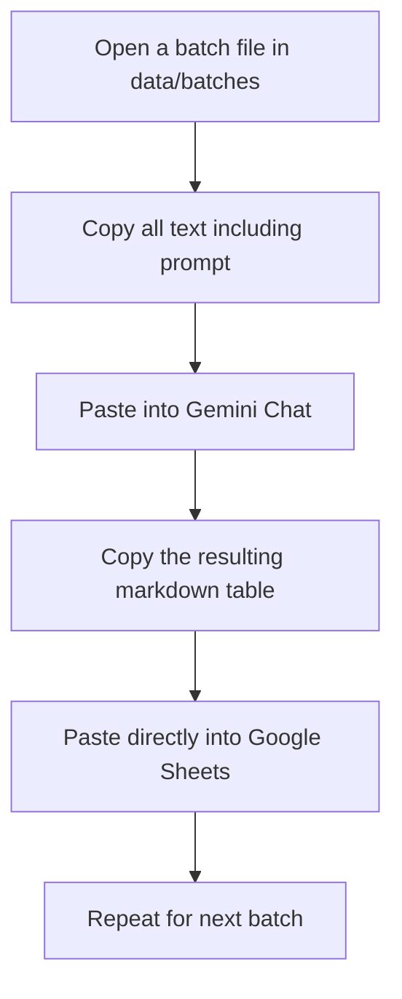

# Guide: Review Tagging using Gemini & Google Sheets

Since you have access to Gemini, we have prepared a copy-paste batch system to make the review tagging process extremely easy and fast. This method does not require any code execution, API keys, or complicated spreadsheet formulas like `=AI()` or `=SPLIT()`.

---

## The Workflow at a Glance



---

## Step-by-Step Instructions

### Step 1: Generate the Batches
1. Run the batch generator script:
   ```bash
   node review-engine/create_gemini_batches.js
   ```
   *(This script reads your 906 reviews from `all_reviews.csv` and splits them into 23 text files of 40 reviews each in the `data/batches/` folder. Each file has the master instructions already written at the top.)*

### Step 2: Set up your Google Sheet
1. Open Google Sheets and create a new spreadsheet named **Spotify Review Analysis**.
2. Create the header row in row 1 with these columns:
   `ID | Sentiment | Barrier Type | Themes | Listening Behavior | Unmet Need | Summary Insight`

### Step 3: Copy and Analyze in Gemini
1. Open the first file: `data/batches/batch_01.txt` in your text editor (like VS Code).
2. Press **Ctrl + A** (select all) and then **Ctrl + C** (copy).
3. Go to [gemini.google.com](https://gemini.google.com/) (or click the Gemini side panel in Google Workspace if you are using Google Workspace Gemini).
4. Paste (**Ctrl + V**) the entire content and press enter.
5. Gemini will process the 40 reviews and output a clean markdown table.

### Step 4: Paste into Google Sheets
1. Hover over Gemini's response and click the **Copy** button (or highlight the table and copy it).
2. Go to your Google Sheet, select the first empty cell in the **ID** column (Cell `A2` for the first batch), and paste (**Ctrl + V**).
3. **If the text pastes into a single column instead of splitting into cells:**
   - Click the little clipboard icon that appears next to the pasted text (Paste Options).
   - Click **Split text to columns**.
   - In the separator dropdown, choose **Custom** and type a vertical pipe character: `|`
   - It will instantly split into the 7 columns perfectly!

### Step 5: Repeat for Batches 02 to 23
1. Open `batch_02.txt`, select all, copy, paste into Gemini.
2. Copy the output table from Gemini.
3. Paste it directly below the previous batch in Google Sheets.
4. Repeat this process until all 23 batches are done.

---

## Column Guide for Reference

Here is what the columns stand for, which Gemini is instructed to fill:

| Column | Allowed Values / Format | Description |
|---|---|---|
| **ID** | Exact ID from the file | Matches the review back to the source data. |
| **Sentiment** | `positive`, `neutral`, `negative` | General tone of the review. |
| **Barrier Type** | `Repetition`, `OverPersonalization`, `BlockedArtistsIgnored`, `SmartShuffleIssues`, `UI_UX_Friction`, `PricingIncrease`, `AlgorithmMismatch`, `Other`, `None` | The core recommendation barrier being complained about. |
| **Themes** | Comma-separated list | Specific keywords like `Discover Weekly`, `Repeat Listening`, `Smart Shuffle`. |
| **Listening Behavior** | E.g. `commute listening`, `playlist curation` | The context in which they listen (or `Not specified`). |
| **Unmet Need** | E.g. `better block list`, `more variety` | What feature/control they wish they had (or `Not specified`). |
| **Summary Insight** | 1-2 sentences | Quick summary of the user's core problem. |

---

## When Done
Once all reviews are tagged, you can export the sheet as a CSV file, save it as `data/analyzed/reviews_tagged.csv`, and we will use it to generate the stats and complete the analysis!
