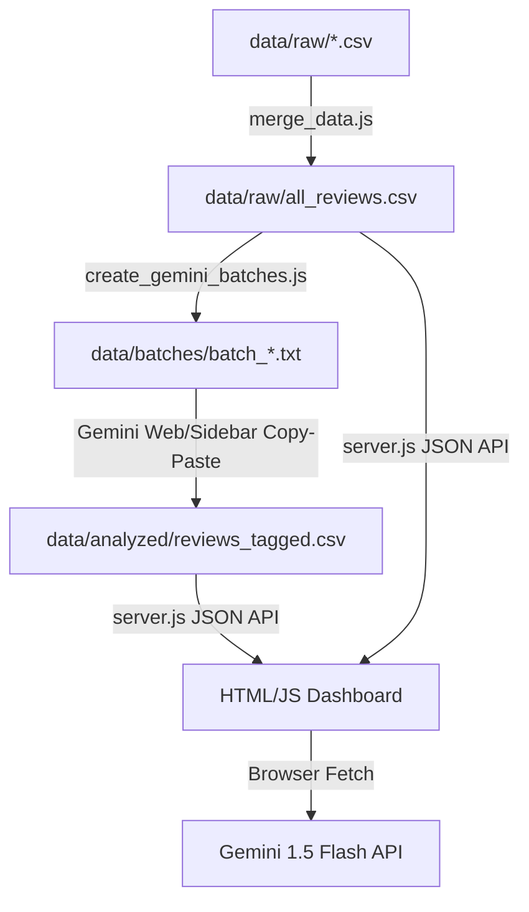

# Review Analysis Engine & Dashboard

AI pipeline and premium visual dashboard to tag, filter, and analyze Spotify user feedback at scale.

---

## Architecture Diagram



---

## File Registry

| File | Purpose |
|------|---------|
| [create_gemini_batches.js](create_gemini_batches.js) | Splits master CSV into 23 text batch files inside `data/batches/` with pre-compiled instructions for manual Gemini copy-pasting. |
| [server.js](server.js) | Zero-dependency Node.js server. Hosts the dashboard static files, parses the CSV reviews on-the-fly, merges them with raw review text, and serves them via `/api/reviews`. |
| [index.html](index.html) | Main HTML layout of the dashboard, including statistics metrics, sidebar filter panels, and the "Ask Gemini" query section. |
| [styles.css](styles.css) | Custom dark-mode stylesheet tailored with Spotify green, Outfit fonts, HSL-based colors, and hover micro-animations. |
| [app.js](app.js) | Client-side reactive rendering. Handles sentiment/barrier filters, regex text search highlights, and browser-to-Gemini API fetch querying. |

---

## How to Run Locally

1. **Navigate to the review engine directory**:
   ```bash
   cd review-engine
   ```

2. **Start the Node.js server**:
   ```bash
   npm start
   ```
   *(Ensure you have run `npm install` once beforehand to install development scrapers, though the server itself has **zero external dependencies**).*

3. **Open the Dashboard**:
   Go to [http://localhost:3000/](http://localhost:3000/) in your web browser.

4. **Ask Gemini Questions**:
   - Get a free API Key from [Google AI Studio](https://aistudio.google.com/).
   - Paste the key in the top-right password field of the dashboard and click **Save Key**.
   - Filter your reviews in the sidebar, type a question in the AI panel, and click **Ask AI**.
